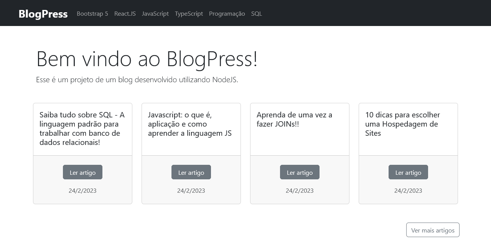

# BlogPress

> Aplicativo de Blog com CRUD completo criado em Node. Foco maior no Back End

### Ajustes e melhorias

Projeto concluído!

- [x] Desenvolvimento de todo o projeto em Node utilizando Express e EJS
- [x] CRUD completo e paginação
- [x] Painel administrativo com Login
- [x] Páginas responsivas com Bootstrap
- [x] Utilização de MySQL para o banco de dados

## 💻 Pré-requisitos

Antes de começar, verifique se você atendeu aos seguintes requisitos:

* Você instalou a versão mais recente de `Node.js`

## 🚀 Instalando BlogPress

Para instalar o BlogPress, siga estas etapas:

* Clone esse repositório com `git clone https://github.com/gguilhermelopes/blogpress`
* Entre na pasta com `cd blogpress`
* Instale as dependências com `npm install`

## ☕ Usando BlogPress

Para usar BlogPress, siga estas etapas:

* Certifique-se de que todas as dependências foram instaladas e que esteja na pasta do projeto. Utilize `node index.js` 
